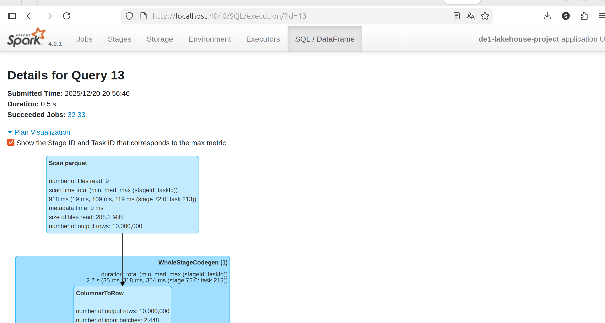
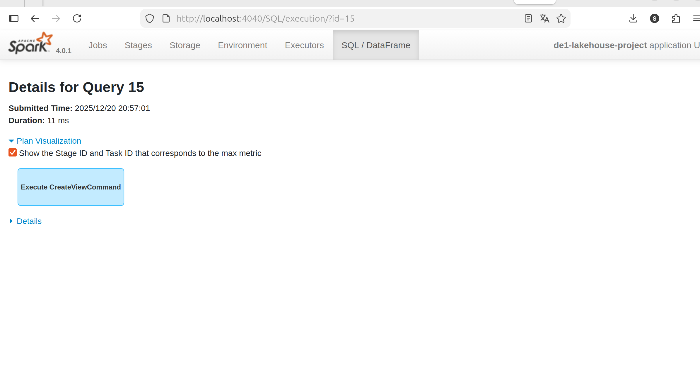
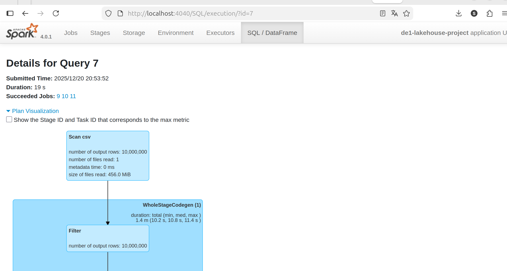
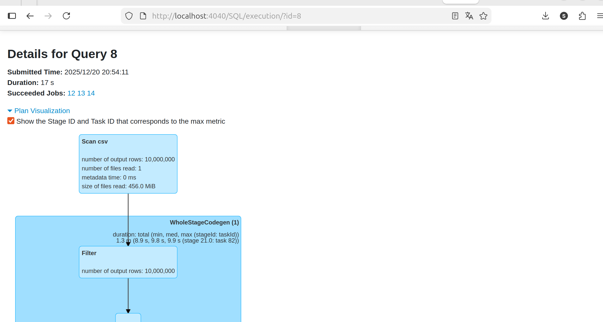

# Final Project – Data Engineering 1

<iframe src="/content/project/project.html" width="100%" height="900px"></iframe>

## 📊 Proof / Outputs
- 
- 
- 
- 
- 
- 
- 
- 
- 

### Text files
- [baseline_q1_plan.txt](assets/baseline_q1_plan.txt)
- [baseline_q2_plan.txt](assets/baseline_q2_plan.txt)
- [baseline_q3_plan.txt](assets/baseline_q3_plan.txt)
- [DE1_Project_Report.md](assets/DE1_Project_Report.md)
- [optimized_q1_plan.txt](assets/optimized_q1_plan.txt)
- [optimized_q2_plan.txt](assets/optimized_q2_plan.txt)
- [optimized_q3_plan.txt](assets/optimized_q3_plan.txt)
- [project_final_genai.md](assets/project_final_genai.md)
